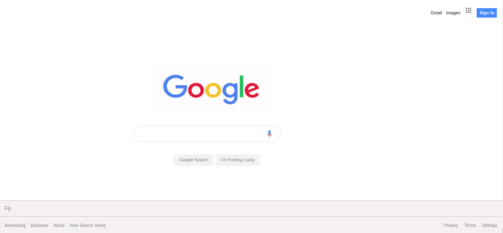

# Google homepage

## Description

This assigned project is my attempt at building the Google homepage using my knowledge at this point on HTML5 and CSS3. Not only is it an attempt but it is also my first attempt at building a web page and replicating an existing web page. The web page does not include any code from JavaScript. 

The purpose of this project is to practise on building a web page using HTML and CSS by replicating an existing one and to have a sense of the "workflow" of a web developer whilst using git commands to push my project and all of the edits made to it to GitHub. All of the links on the web page do work - they would send the user to its destination (the names of the links are self-descriptive) upon clicking on them. 

*Note: As it is my first project, my main goal other than replicating the web page and having a sense of the workflow is to sharpen all of these new skills throughout the project (and many more ahead of me) which in fact includes  writing a proper README.md that is extremely detailed and comprehensive enough for any person perusing this repository.*

## Screenshot of project/web page

## Author

Losalini Rokocakau.
**GitHub username:** *chelmerrox*